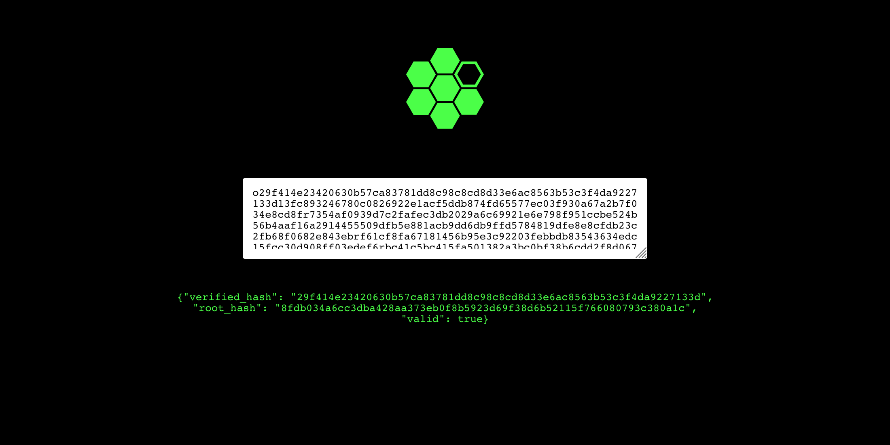

# lor-verifier

Verify LoR Merkle proofs.



## Deployment
Edit the `webapp/env.sh` and change the value of the environment variable `API_ENDPOINT` to the endpoint that the interface will use.

Launch both the interface and the API with:
```bash
./launch.sh
```

This will build the Docker images and launch the following compose file:
```yaml
version: "3.4"

services:
  lor-api:
    container_name: lor-api
    build: 
      context: ./api
    ports:
      - 8080:8080

  lor-webapp:
    container_name: lor-webapp
    build:
      context: ./webapp
    ports:
      - 80:80
```

## HTTP API
You can query the HTTP directly. There is a single endpoint mapped to `/` followed by the proof you want to verify.
```bash
curl https://api.verifier.graphn.dev/o29f414e23420630b57ca83781dd8c98c8cd8d33e6ac8563b53c3f4da9227133dl3fc893246780c0826922e1acf5ddb874fd65577ec03f930a67a2b7f034e8cd8fr7354af0939d7c2fafec3db2029a6c69921e6e798f951ccbe524b56b4aaf16a29l4455509dfb5e881acb9dd6db9ffd5784819dfe8e8cfdb23c2fb68f0682e843ebrf61cf8fa67181456b95e3c92203febbdb83543634edc15fcc30d908ff03edef6rbc41c5bc415fa501382a3bc0bf38b6cdd2f8d0678072b31866f4047659866079rd6b5a219b474b2f81cf198bee84777a2d268d2fb4fa6aeed312f34b99c1e0d9cl8f2ec2c1757274c9a8d1c106eca9cb4f1f560923b7d94430dde65c1954c845a9rd36b63988fb44162112e30427488e1416cf2890acf9ffdb887ecc2bf99fb9d15l98340d29299f63e1e42a88899641ca65a158cf54976d6ecc1e9d5f7df45d0e69rf42b03ae8225b49f5ba19ba473358cd09c0b1c8825215e7211980be0ea21d5e8la6acfe1f00dfd9bbe3976c41b9725959b5d78eef347b58858e437590efa20554lc60edf74e8cdb335d88dae9f6170435ad290e01a5cbbdea847d20576f4e76925l42ee189ffa8f406a5a4b262515c292aec6e771aca4d6383b16da41ec208f73f7l59d059d7dba20940c5385386e926a48415eec587d5e9426f3da7336fbee7490fr1639ef7d960c3f597ba5bc6df69dc53613bea09f753e7c848a4734791e73a021l3e276161cddc4781ee58b256840fad58037addd7565391a3469bdc55e4e02d188fdb034a6cc3dba428aa373eb0f8b5923d69f38d6b52115f766080793c380a1c
```
```json
{"verified_hash":"29f414e23420630b57ca83781dd8c98c8cd8d33e6ac8563b53c3f4da9227133d","root_hash":"8fdb034a6cc3dba428aa373eb0f8b5923d69f38d6b52115f766080793c380a1c","valid":true}
```
---
```bash
curl https://api.verifier.graphn.dev/o29f414e23420630b57ca83781dd8c98c8cd8d33e6ac8563b53c3f4da9227133dl3fc893246780c0826922e1acf5ddb874fd65577ec03f930a67a2b7f034e8cd8fr7354af0939d7c2fafec3db2029a6c69921e6e798f951ccbe524b56b4aaf16a29l4455509dfb5e881acb9dd6db9ffd5784819dfe8e8cfdb23c2fb68f0682e843ebrf61cf8fa67181456b95e3c92203febbdb83543634edc15fcc30d908ff03edef6rbc41c5bc415fa501382a3bc0bf38b6cdd2f8d0678072b31866f4047659866079rd6b5a219b474b2f81cf198bee84777a2d268d2fb4fa6aeed312f34b99c1e0d9cl8f2ec2c1757274c9a8d1c106eca9cb4f1f560923b7d94430dde65c1954c845a9rd36b63988fb44162112e30427488e1416cf2890acf9ffdb887ecc2bf99fb9d15l98340d29299f63e1e42a88899641ca65a158cf54976d6ecc1e9d5f7df45d0e69rf42b03ae8225b49f5ba19ba473358cd09c0b1c8825215e7211980be0ea21d5e8la6acfe1f00dfd9bbe3976c41b9725959b5d78eef347b58858e437590efa20554lc60edf74e8cdb335d88dae9f6170435ad290e01a5cbbdea847d20576f4e76925l42ee189ffa8f406a5a4b262515c292aec6e771aca4d6383b16da41ec208f73f7l59d059d7dba20940c5385386e926a48415eec587d5e9426f3da7336fbee7490fr1639ef7d960c3f597ba5bc6df69dc53613bea09f753e7c848a4734791e73a021l3e276161cddc4781ee58b256840fad58037addd7565391a3469bdc55e4e02d188fdb034a6cc3dba428aa373eb0f8b5923d69f38d6b52115f766080793c380a1c
```
```json
{"verified_hash":"29f414e23420630b57ca83781dd8c98c8cd8d33e6ac8563b53c3f4da9227133d","root_hash":"8fdb034a6cc3dba428aa373eb0f8b5923d69f38d6b52115f766080793c380a1c","valid":true}
```
